+++
slug = 'aws-databases'
title = 'AWS Databases'
date = 2024-07-09T17:00:00+10:00
draft = false
author = 'luojiahai'
+++

## Data Types

### Data source types

#### Structured

Structured data is often organized to support transactional and analytical applications.

#### Semi-structured

Semi-structured data can be just as predictable and organized as structured data.

Examples of semi-structured data include XML, email, and JSON.

#### Unstructured

Unstructured data is not organized in any distinguishable or predefined manner.

Examples of data considered to be unstructured are text messages, word processing documents, videos, photos, and other
images.

### Types of databases

Depending on the database type, a database may support more than one data source type.

#### Relational databases

A relational database is built to store structured data in tables using a defined schema.

#### Nonrelational key-value databases

Key-value databases are a type of nonrelational database that store unstructured data in the form of key-value pairs.

#### Nonrelational document databases

Document stores are a type of nonrelational database that store semi-structured and unstructured data in the form of
files. 

#### Nonrelational in-memory databases

In-memory data stores can be used for both structured and semi-structured data sources.

#### Nonrelational graph databases

Graph databases are purpose-built to store any type of data: structured, semi-structured, or unstructured.

#### Nonrelational Ledger databases

Ledger databases can be used for both structured and semi-structured data sources.

#### Nonrelational Wide-column databases

Wide-column databases can be used for  structured data sources.

#### Nonrelational Time-series databases

Time-series databases can be used for structured data sources.

## Relational Databases

### Amazon Relational Database Service (Amazon RDS)

Amazon Relational Database Service (Amazon RDS) makes it easy to set up, operate, and scale a relational database in the
cloud.

#### Use Case: Server-based web application

#### Use Case: Disaster recovery

#### Use Case: Real-time data analytics

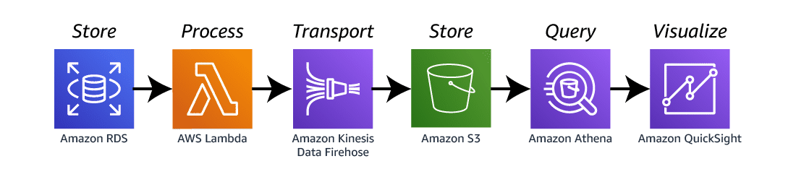

### Amazon Aurora

Aurora is a MySQL- and PostgreSQL-compatible relational database built for the cloud that combines the performance and
availability of traditional enterprise databases with the simplicity and cost-effectiveness of open-source databases.

#### Use Case: Public source data ingestion

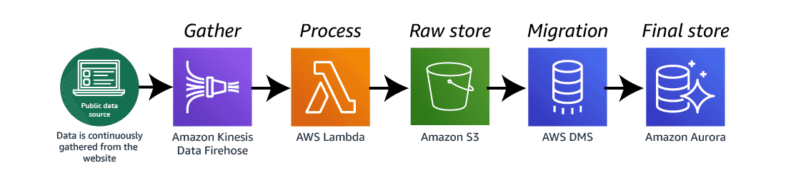

## Nonrelational Databases

### Amazon DynamoDB

DynamoDB is a fully managed, serverless, key-value, NoSQL database designed to run high-performance applications at any
scale.

#### Use Case: Serverless web application

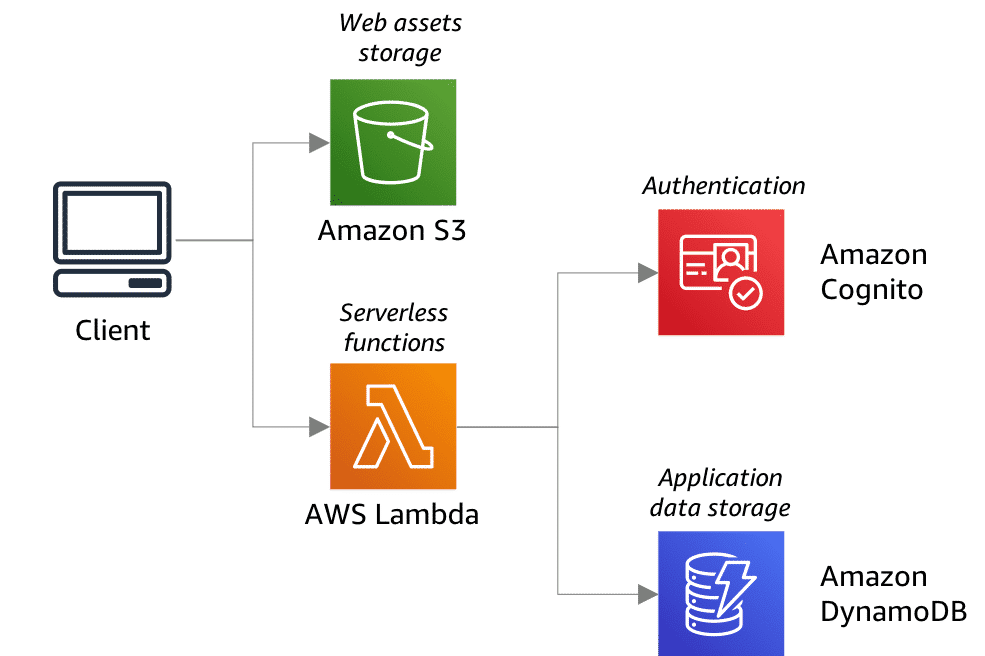

#### Use Case: Anomaly detection on Amazon DynamoDB Streams

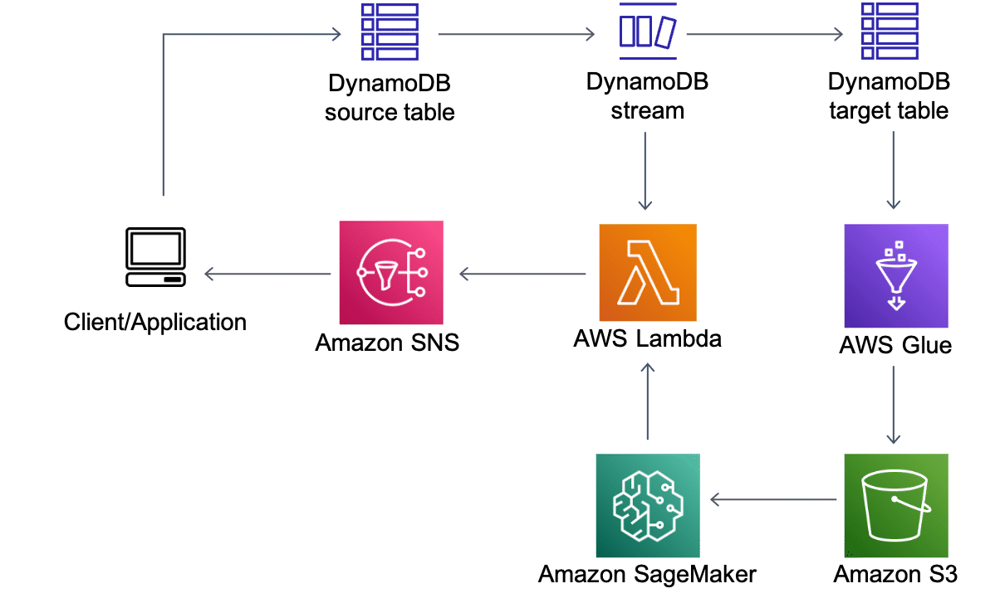

### Amazon Keyspaces (for Apache Cassandra)

Amazon Keyspaces (for Apache Cassandra) is a scalable, highly available, and managed database service that is compatible
with Apache Cassandra.

### Amazon DocumentDB

Amazon DocumentDB (with MongoDB compatibility) is a fast, reliable, and fully managed database service.

#### Use Case: Online user profile

#### Use Case: Real-time mobile web application

### Amazon Neptune

Amazon Neptune is a fast, reliable, fully managed graph database service that streamlines building and running
applications that work with highly connected datasets.

#### Use Case: Fraud detection

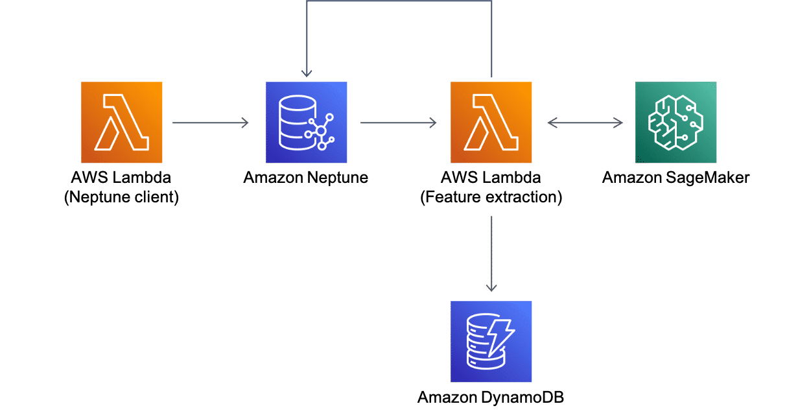

#### Use Case: RSS keyword capture

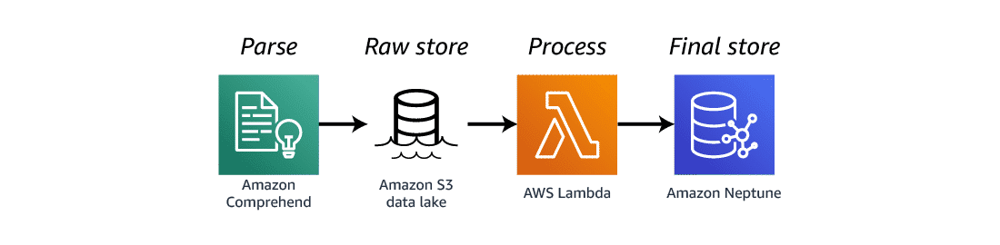

### Amazon Timestream

Amazon Timestream is a fast, scalable, and serverless time-series database service for Internet of Things (IoT) and
operational applications that makes it easy to store and analyze trillions of events per day.

#### Use Case: IoT sensor data capture

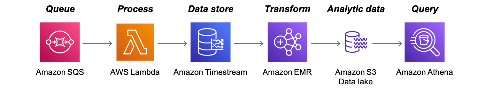

### Amazon Quantum Ledger Database (Amazon QLDB)

Amazon Quantum Ledger Database (Amazon QLDB) is a fully managed ledger database that provides a transparent, immutable,
and cryptographically verifiable transaction log owned by a central trusted authority.

#### Use Case: Delivering cryptographically secure and verifiable medical data

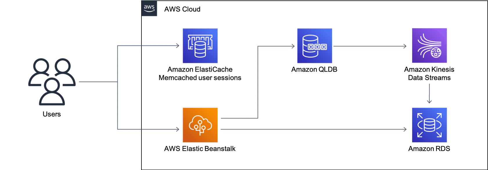

### Amazon ElastiCache

ElastiCache offers fully managed Redis and Memcached distributed memory caches. Seamlessly deploy, run, and scale
popular open source-compatible, in-memory data stores.

#### Use Case: WordPress database cache

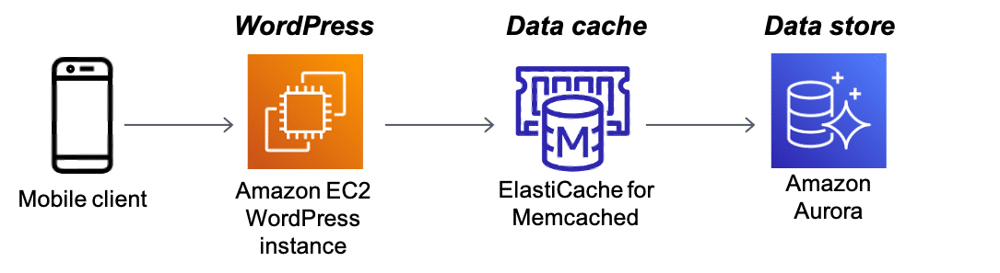

#### Use Case: Scalable distributed cache

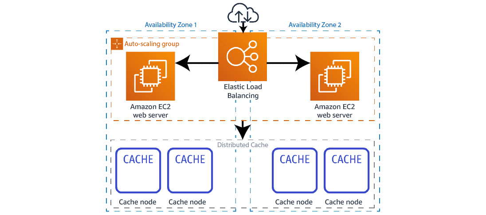

### Amazon MemoryDB for Redis

Amazon MemoryDB for Redis is a Redis-compatible, durable, in-memory database service that delivers ultra-fast
performance.

#### Use Case: Redis data structures for microservices

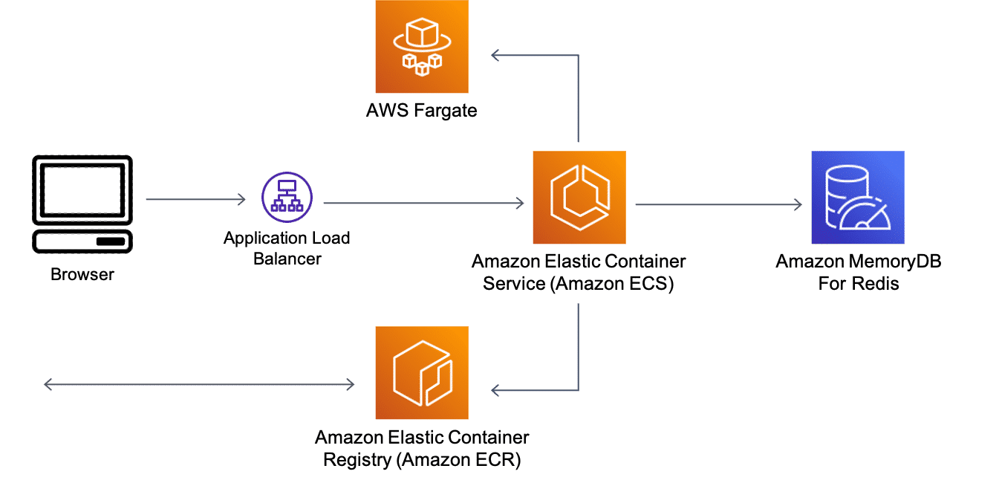

## Data Access and Analysis

### Amazon Redshift

Amazon Redshift is a fast, scalable data warehouse that makes it simple and cost effective to analyze all your data
across your data warehouse and data lake.

#### Use Case: Rich data platform

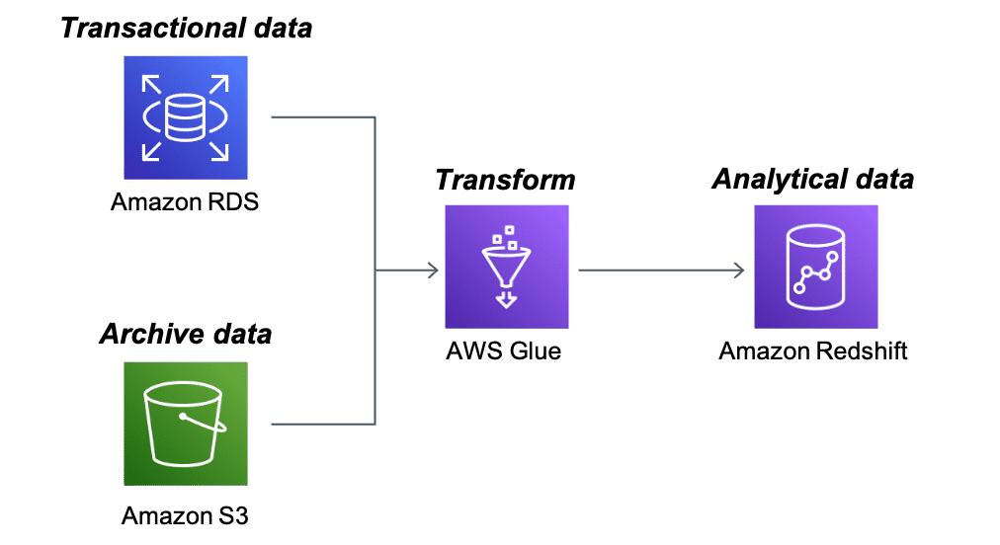

#### Use Case: Event-driven data analysis

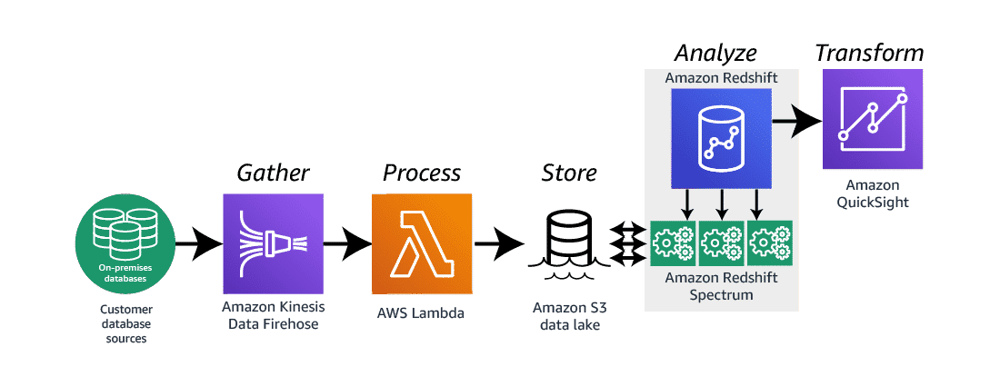

### Amazon Athena

Athena is an interactive query service that facilitates analyzing data in Amazon S3 using standard SQL.

#### Use Case: Building for Athena Federated Query

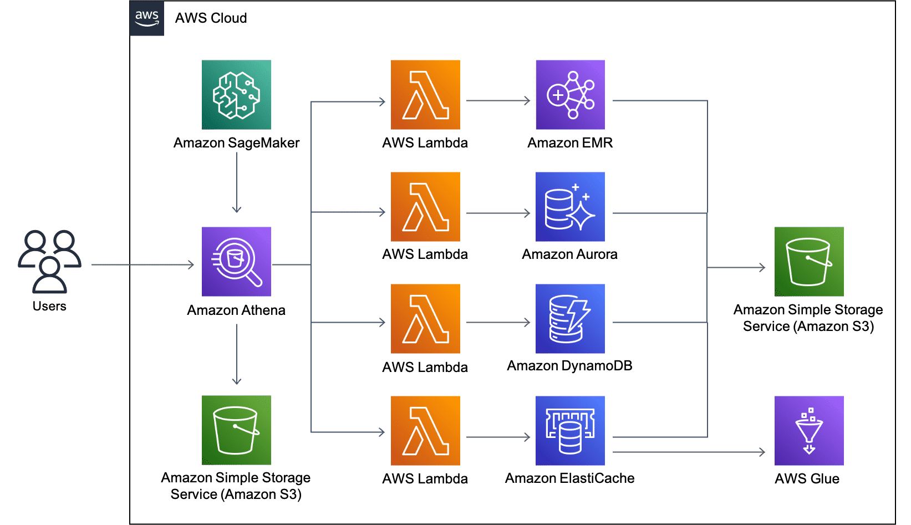

---
