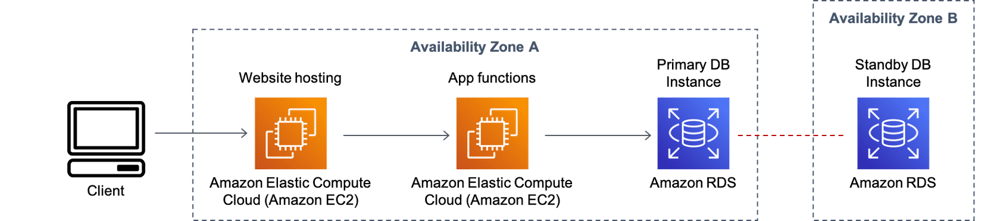
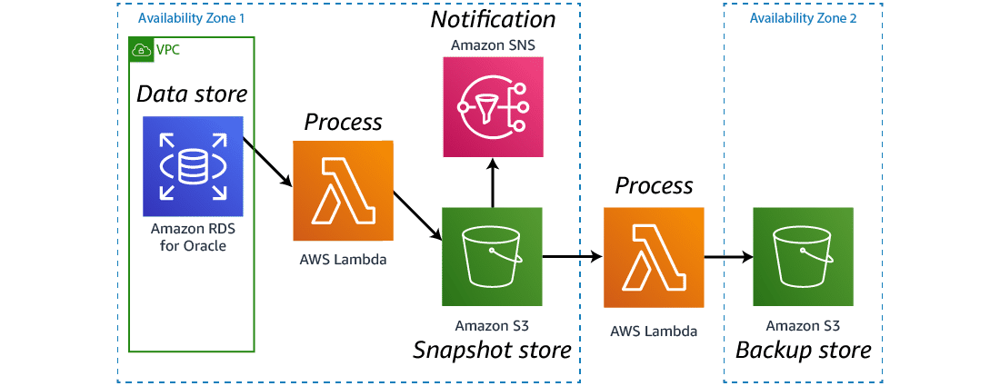

+++
slug = 'aws-databases'
title = 'AWS Databases'
date = 2024-07-09T18:00:00+10:00
draft = false
author = 'luojiahai'
+++

## Data Types

### Data source types

#### Structured

Structured data is often organized to support transactional and analytical applications.

#### Semi-structured

Semi-structured data can be just as predictable and organized as structured data.

Examples of semi-structured data include XML, email, and JSON.

#### Unstructured

Unstructured data is not organized in any distinguishable or predefined manner.

Examples of data considered to be unstructured are text messages, word processing documents, videos, photos, and other
images.

### Types of databases

Depending on the database type, a database may support more than one data source type.

#### Relational databases

A relational database is built to store structured data in tables using a defined schema.

#### Nonrelational key-value databases

Key-value databases are a type of nonrelational database that store unstructured data in the form of key-value pairs.

#### Nonrelational document databases

Document stores are a type of nonrelational database that store semi-structured and unstructured data in the form of
files. 

#### Nonrelational in-memory databases

In-memory data stores can be used for both structured and semi-structured data sources.

#### Nonrelational graph databases

Graph databases are purpose-built to store any type of data: structured, semi-structured, or unstructured.

#### Nonrelational Ledger databases

Ledger databases can be used for both structured and semi-structured data sources.

#### Nonrelational Wide-column databases

Wide-column databases can be used for  structured data sources.

#### Nonrelational Time-series databases

Time-series databases can be used for structured data sources.

## Relational Databases

TODO

### Amazon Relational Database Service (Amazon RDS)

TODO

### Amazon Aurora

TODO

## Nonrelational Databases

TODO

### Amazon DynamoDB

TODO

### Amazon Keyspaces (for Apache Cassandra)

TODO

### Amazon DocumentDB

TODO

### Amazon Neptune

TODO

### Amazon Timestream

TODO

### Amazon Quantum Ledger Database (Amazon QLDB)

TODO

### Amazon ElastiCache

TODO

### Amazon MemoryDB for Redis

TODO

## Data Access and Analysis

TODO

### Amazon Redshift

TODO

### Amazon Athena

TODO

## Architectures

### Server-based web application

This architecture includes website content and application functions hosted on Amazon EC2 instances. Amazon RDS provides
data store in multiple Availability Zones for fault tolerance.

### Serverless web application

This architecture includes website content stored in Amazon Simple Storage Service (Amazon S3), application code
executed using AWS Lambda functions, user authentication provided by Amazon Cognito, and DynamoDB to store application
data.

### Disaster recovery

Amazon RDS for Oracle commonly runs mission critical databases. If anything were to happen to these databases, it would
be devastating.

This architecture is one option for creating a disaster recovery solution for the databases.

### Real-time data analytics

Amazon RDS databases are busy places. When real-time data analytics are run directly against the Amazon RDS database, it
can cause latency.

One solution is to create an architecture that moves these records off the database for analysis.

