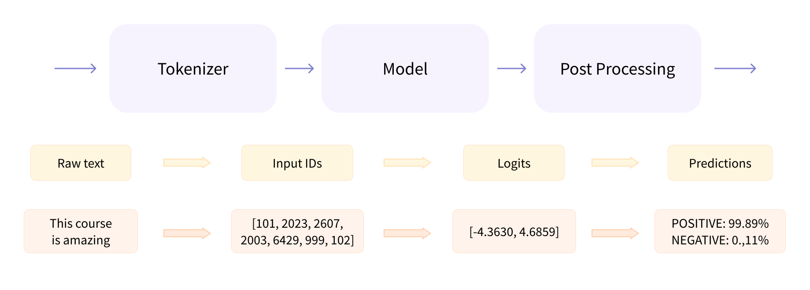

+++
slug = 'transformers-basics'
title = '🤗 Transformers: Basics'
date = 2024-06-19T20:00:00+10:00
draft = false
author = 'luojiahai'
+++

[🤗 Transformers](https://huggingface.co/docs/transformers/) provides APIs and tools to easily download and train
state-of-the-art pretrained models. These models support common tasks in different modalities, such as Natural Language
Processing, Computer Vision, Audio, and Multimodal.

## Pipeline

```python
from transformers import pipeline

classifier = pipeline('sentiment-analysis')
intputs = [
    'I love this so much!',
    'I hate this so much!',
]
outputs = classifier(intputs)
```

The pipeline groups together three steps: preprocessing, passing the inputs through the model, and postprocessing:



### Preprocessing with a tokenizer

```python
from transformers import AutoTokenizer

checkpoint = 'distilbert-base-uncased-finetuned-sst-2-english'
tokenizer = AutoTokenizer.from_pretrained(checkpoint)

raw_intputs = [
    'I love this so much!',
    'I hate this so much!',
]
inputs = tokenizer(raw_inputs, padding=True, truncation=True, return_tensors='pt')
```

### Going through the model

```python
from transformers import AutoModel

checkpoint = 'distilbert-base-uncased-finetuned-sst-2-english'
model = AutoModel.from_pretrained(checkpoint)
# model = AutoModelForSequenceClassification.from_pretrained(checkpoint)
outputs = model(**inputs)
```

### Postprocessing the output

```python
import torch

predictions = torch.nn.functional.softmax(outputs.logits, dim=-1)
```

## Models

[Auto Classes](https://huggingface.co/docs/transformers/model_doc/auto) are wrappers over the wide variety of models
available in the library. It can automatically guess the appropriate model architecture for your checkpoint, and then
instantiates a model with this architecture.

However, if you know the type of model you want to use, you can use the class that defines its architecture directly.

### Loading and saving

```python
from transformers import BertModel

model = BertModel.from_pretrained('bert-base-cased')
```

```python
model.save_pretrained('directory_on_my_computer')
```

## Tokenizers

Tokenizers translate text into data that can be processed by the model. Models can only process numbers, so tokenizers
need to convert our text inputs to numerical data.

### Loading and saving

```python
from transformers import BertTokenizer

tokenizer = BertTokenizer.from_pretrained('bert-base-cased')
model_inputs = tokenizer('Using a Transformer network is simple')
```

```python
tokenizer.save_pretrained('directory_on_my_computer')
```

### Encoding and decoding

```python
from transformers import AutoTokenizer

tokenizer = AutoTokenizer.from_pretrained("bert-base-cased")

sequence = "Using a Transformer network is simple"
tokens = tokenizer.tokenize(sequence)
ids = tokenizer.convert_tokens_to_ids(tokens)
```

```python
decoded_string = tokenizer.decode(ids)
```

---
