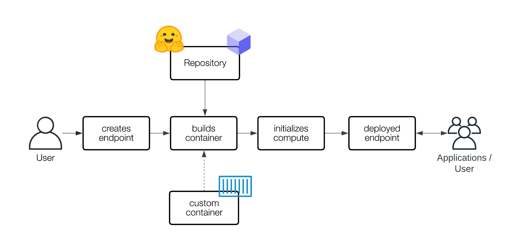

+++
slug = 'transformers-inference'
title = '🤗 Transformers: Inference'
date = 2024-06-20T20:00:00+10:00
draft = false
author = 'luojiahai'
+++

Inference is the process of using a pretrained model to generate outputs on new data.

## Hugging Chat

[Hugging Chat](https://huggingface.co/chat/) is an open-source interface enabling everyone to try open-source large
language models.

## Inference API

[Inference API](https://huggingface.co/docs/api-inference/) is free to use, and rate limited. You can test and evaluate
publicly accessible machine learning models, or your own private models, via simple HTTP requests, with fast inference
hosted on Hugging Face shared infrastructure.

### Running Inference with API Requests

Get a User Access or API token [in your Hugging Face profile settings](https://huggingface.co/settings/tokens).

Choose which model you are going to run. Go to the [Model Hub](https://huggingface.co/models) and select the model you
want to use.

```
ENDPOINT = https://api-inference.huggingface.co/models/<MODEL_ID>
```

Let’s use [gpt2](https://huggingface.co/gpt2) as an example. To run inference, simply use this code:

Python:

```python
import requests
API_URL = 'https://api-inference.huggingface.co/models/gpt2'
headers = {'Authorization': f'Bearer {API_TOKEN}'}
def query(payload):
    response = requests.post(API_URL, headers=headers, json=payload)
    return response.json()
data = query('Can you please let us know more details about your ')
```

JavaScript:

```javascript
import fetch from "node-fetch";
async function query(data) {
    const response = await fetch(
        "https://api-inference.huggingface.co/models/gpt2",
        {
            headers: { Authorization: `Bearer ${API_TOKEN}` },
            method: "POST",
            body: JSON.stringify(data),
        }
    );
    const result = await response.json();
    return result;
}
query("Can you please let us know more details about your ").then((response) => {
    console.log(JSON.stringify(response));
});
```

cURL:

```bash
curl https://api-inference.huggingface.co/models/gpt2 \
        -X POST \
        -d '"Can you please let us know more details about your "' \
        -H "Authorization: Bearer ${API_TOKEN}"
```

## Inference Endpoints

[Inference Endpoints](https://huggingface.co/docs/inference-endpoints/) offers a secure production solution to easily
deploy any Transformers, Sentence-Transformers and Diffusion models from the Hub on dedicated and autoscaling
infrastructure managed by Hugging Face.

With Inference Endpoints, you can easily deploy any machine learning model on dedicated and fully managed
infrastructure.



For usage, see this article: [Getting Started with Hugging Face Inference Endpoints](https://huggingface.co/blog/inference-endpoints).

## Pipelines

The pipelines are objects that abstract most of the complex code from the library, offering a simple API dedicated to
several tasks.

### The pipeline abstraction

The `pipeline()` is a utility factory method to build a `Pipeline`. There are multiple ways to use a pretrained model to
run inference with the pipeline:

#### Use remote model given a task

```python
import transformers
pipeline = transformers.pipeline(task='text-classification')
outputs = pipeline(inputs='This restaurant is awesome')
```

#### Use remote model given a model identifier

```python
import transformers
pipeline = transformers.pipeline(model='FacebookAI/roberta-large-mnli')
outputs = pipeline(inputs='This restaurant is awesome')
```

#### Use local model

```python
import transformers
model = transformers.AutoModelForSequenceClassification.from_pretrained(pretrained_model_name_or_path='path/to/model')
tokenizer = transformers.AutoTokenizer.from_pretrained(pretrained_model_name_or_path='path/to/model')
pipeline = transformers.pipeline(task='text-classification', model=model, tokenizer=tokenizer)
outputs = pipeline(inputs='This restaurant is awesome')
```

## Auto Classes

[Auto Classes](https://huggingface.co/docs/transformers/model_doc/auto) automatically retrieves the architecture of a
pretrained model from its name/path to the pretrained weights/config/vocabulary. You only need to select the appropriate
`AutoClass` for your task and it’s associated preprocessing class.

```python
import transformers

model_name = 'distilbert/distilbert-base-uncased-finetuned-sst-2-english'

# preprocess
model = transformers.AutoModelForSequenceClassification.from_pretrained(pretrained_model_name_or_path=model_name)
tokenizer = transformers.AutoTokenizer.from_pretrained(pretrained_model_name_or_path=model_name)
inputs = tokenizer('This restaurant is awesome', return_tensors='pt')

# forward
outputs = model(**inputs)

# postprocess
scores = outputs['logits'][0]
dict_scores = [{'label': model.config.id2label[i], 'score': score.item()} for i, score in enumerate(scores)]
```

---
